<div align="center">

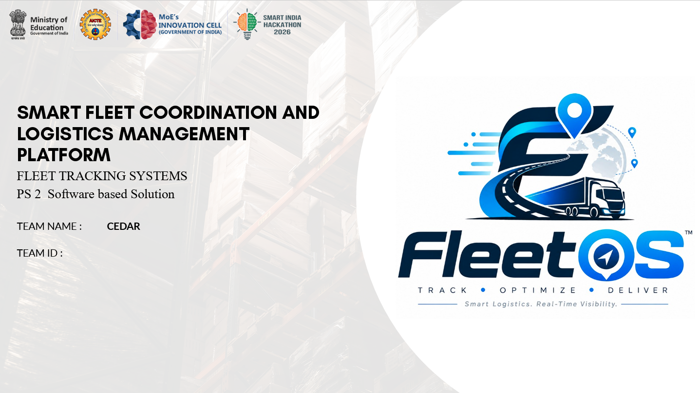

# FleetOS

### Smart Fleet Coordination & Logistics Management Platform

<p>
<strong>Track • Optimize • Allocate • Deliver</strong>
</p>

<p>
Real-time fleet visibility · Driver–vehicle allocation · Shipment lifecycle · Route intelligence · Role-based operations
</p>

<p>
<b>Smart India Hackathon 2026 · PS2 · Software-based Solution</b><br>
<b>Team: CEDAR</b>
</p>

</div>

---

## 1. Problem & Solution

Fleet operations are not just a GPS problem. A useful logistics platform has to connect vehicle availability, driver assignment, cargo constraints, shipment state, routing and operational visibility in one workflow.

**FleetOS** is built as that operational layer. It provides a unified interface for fleet monitoring, driver–vehicle allocation, shipment management, route computation, live map visibility and role-based administration.

The prototype is designed around the SIH problem framing and demonstrates the end-to-end logistics workflow using simulated/operational data rather than requiring physical tracking hardware.

### What the platform addresses

- Fleet visibility
- Vehicle utilization
- Cargo-to-vehicle assignment
- Driver coordination
- Shipment transparency
- Route planning
- Operational monitoring

---

## 2. Fleet Operations

The Fleet Operations workspace gives dispatch and operations users a centralized view of the vehicle roster.

It exposes vehicle registration data, class, fuel type, payload capacity, assigned driver and current operational state. Vehicles can be filtered by states such as **Available, En Route, Idle and Maintenance**.

### Implemented capabilities

- Vehicle registration and management
- Vehicle classes and fuel types
- Payload capacity tracking
- Driver assignment
- Operational status tracking
- Fleet filtering

<p align="center">
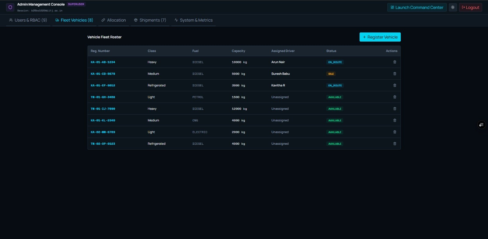
</p>

*Administrator fleet roster showing vehicle class, fuel, capacity, assigned driver and status.*

---

## 3. Driver–Vehicle Allocation

FleetOS treats driver and vehicle allocation as an explicit operational workflow instead of embedding it inside shipment creation.

The allocation workspace shows active drivers on one side and the complete vehicle pool on the other, making current assignments and unassigned vehicles immediately visible.

### Allocation logic

The current implementation follows a constraint-first, greedy allocation approach:

```text
Pending Shipment
      │
      ▼
Vehicle availability
      │
      ▼
Vehicle-type compatibility
      │
      ▼
Cargo capacity check
      │
      ▼
Distance to pickup
      │
      ▼
Rank feasible candidates
      │
      ▼
Create driver ↔ vehicle ↔ shipment assignment
```

The current prototype uses a **greedy nearest-vehicle strategy** after compatibility and capacity filtering. More advanced optimization is part of the production roadmap.

<p align="center">
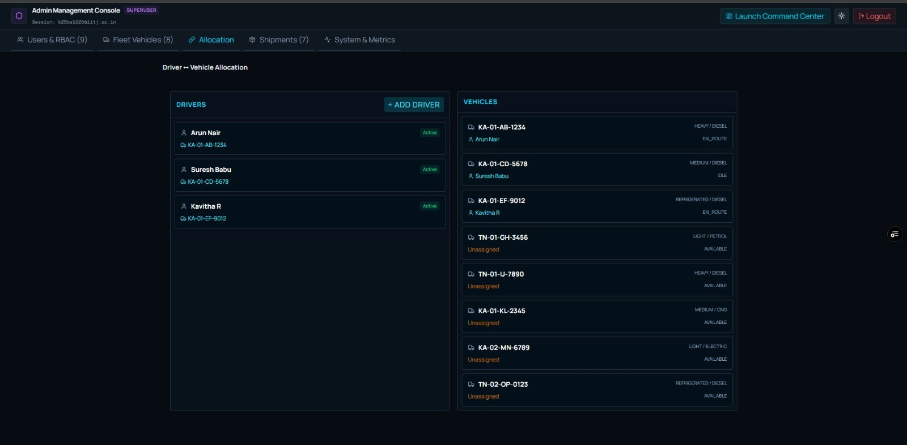
</p>

*Driver–vehicle allocation workspace with active drivers, assigned vehicles and available fleet.*

---

## 4. Intelligent Auto-Allocation

The Command Center exposes an **AI Auto-Allocate** control for operational assignment. In the current prototype, this represents the automated allocation workflow rather than a claim that a trained machine-learning model is already making production decisions.

The implemented allocator evaluates operational constraints and ranks feasible vehicles before creating the assignment.

This distinction matters: the SIH technical concept includes AI-based allocation and route optimization, while the present prototype uses deterministic allocation logic that can later be replaced or extended by OR-Tools/ML optimization services.

<p align="center">
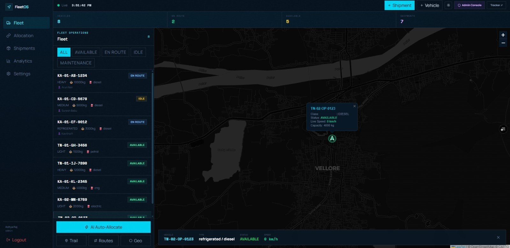
</p>

*Command Center showing the AI Auto-Allocate control alongside the live fleet workspace.*

---

## 5. Live Fleet Command Center

The Fleet Command Center is the primary operational view. It combines fleet statistics, vehicle status panels, map visualization and vehicle-level details.

### Live operational view

- Total vehicles
- Vehicles en route
- Available vehicles
- Shipment count
- Fleet filters
- Vehicle markers
- Vehicle status popovers
- Current speed and capacity
- Map controls

<p align="center">
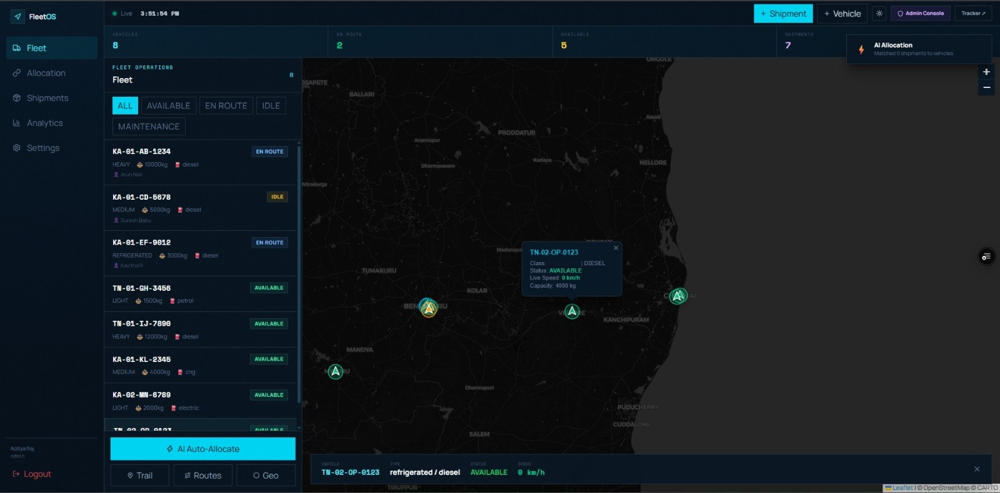
</p>

*Regional fleet view with multiple vehicle markers and operational status information.*

---

## 6. Geographic Fleet Tracking

FleetOS uses an interactive map layer to visualize vehicle positions and operational state. The prototype uses Leaflet-based mapping and supports different visual map presentations.

The map is not treated as an isolated screen: vehicle selection, status, speed, capacity and fleet filters are connected to the operational data displayed around it.

<p align="center">
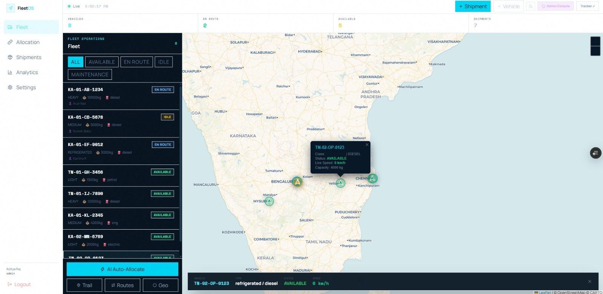
</p>

*Light map presentation showing the geographic fleet distribution across the region.*

---

## 7. Real-Time Tracking Architecture

The implemented real-time layer uses **Socket.IO** to broadcast vehicle telemetry and operational state changes from the backend to connected clients.

```text
Driver / GPS Source
        │
        ▼
   GPS Update API
        │
        ▼
   Express Backend
        │
        ▼
 Socket.IO Events
        │
        ├──────────► Command Center Map
        ├──────────► Fleet Status Panels
        └──────────► Vehicle Detail Views
```

This allows the command center to update operational state without repeatedly refreshing the page.

<p align="center">

</p>

*The command center provides the visual endpoint for real-time fleet state.*

---

## 8. Shipment Management

Shipments are treated as operational entities rather than simple records. Each manifest contains cargo information, origin, destination, weight, status and tracking information.

### Shipment lifecycle

```text
PENDING → ALLOCATED → PICKED UP → IN TRANSIT → DELIVERED
                         │
                         └──────────────→ CANCELLED
```

### Shipment capabilities

- Cargo description
- Weight and priority
- Origin and destination
- Vehicle assignment
- Driver assignment
- Shipment status
- Tracking token
- Special instructions
- Proof-of-delivery support

<p align="center">
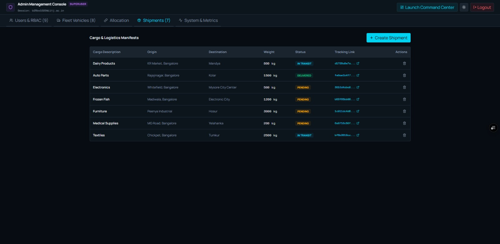
</p>

*Shipment management console showing cargo, origin, destination, weight, status and tracking links.*

---

## 9. Create Shipment Workflow

The shipment creation workflow captures the operational information needed before dispatch.

The form supports cargo description, weight, priority, vehicle requirements, origin, destination, operational assignment and special instructions.

Location resolution converts human-readable locations into coordinates for downstream mapping and routing.

<p align="center">
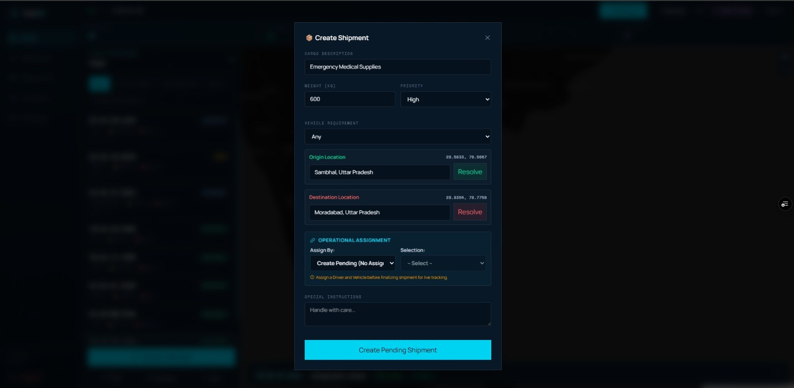
</p>

*Shipment creation form with cargo, priority, vehicle requirement, origin/destination and assignment controls.*

---

## 10. Route Optimization

FleetOS combines road-network routing with a deterministic geographic fallback.

```text
Origin + Destination + Vehicle Constraints
                    │
                    ▼
                  OSRM
                    │
          ┌─────────┴─────────┐
          │                   │
       Available          Unavailable
          │                   │
          ▼                   ▼
   Road route +          Haversine
   route geometry        distance fallback
          │                   │
          └─────────┬─────────┘
                    ▼
              Route response
```

The current route layer supports:

- OSRM road routing
- Route geometry/polyline data
- Multi-stop planning
- Haversine distance calculations
- Fallback behavior when external routing is unavailable
- Vehicle/fuel-aware cost estimation

The SIH technical approach proposes expanding this layer with optimization tooling such as OR-Tools. That is a planned production-scale enhancement, not something this README claims is already fully deployed.

<p align="center">

</p>

*Map interface used as the geographic foundation for route and fleet operations.*

---

## 11. Users, Authentication & RBAC

FleetOS separates access according to operational responsibility. The administrator console provides user management and role-based controls.

### Supported operational roles

| Role | Workspace | Primary responsibility |
|---|---|---|
| Administrator | Admin Management Console | Users, RBAC, fleet, shipments, metrics |
| Dispatcher | Fleet Command Center | Monitoring, shipment creation, allocation, routes |
| Driver | Driver Workspace | Active assignments and execution |
| Customer | Customer Tracking | Shipment visibility and delivery status |

### Security controls implemented in the application

- JWT authentication
- Role-based authorization
- Email OTP verification
- Google OAuth integration through Firebase
- bcrypt password hashing
- Helmet security headers
- Authentication rate limiting
- Request validation
- Restricted administrator access

<p align="center">
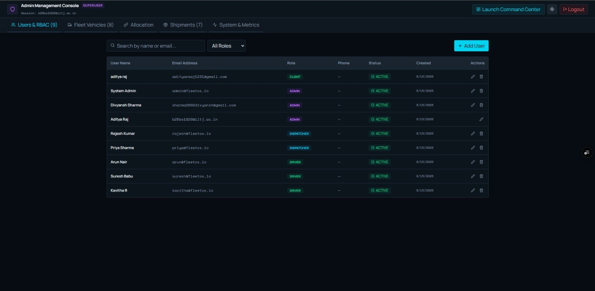
</p>

*Administrator Users & RBAC console showing operational roles and account states.*

---

## 12. User-Type Selection

The onboarding flow first separates **Internal Staff** from **Customer** access.

This prevents the initial entry point from becoming a single generic login experience and establishes the correct operational path before role-specific access is selected.

<p align="center">
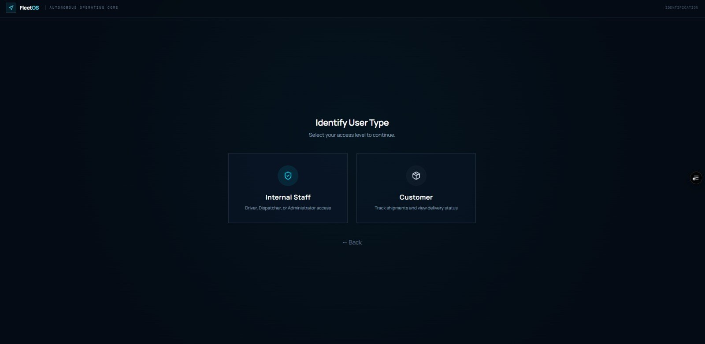
</p>

*Initial FleetOS access-level selection: Internal Staff or Customer.*

---

## 13. Workspace & Role Selection

Internal staff are then routed toward their operational workspace: **Driver, Dispatcher or Administrator**.

This is the second stage of the onboarding flow and maps access to the intended operational responsibility.

<p align="center">
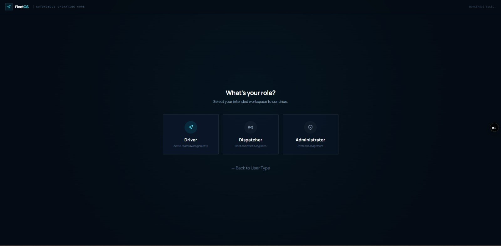
</p>

*Internal staff role selection for Driver, Dispatcher or Administrator workspaces.*

---

## 14. Administrator Fleet Console

The administrator console aggregates the operational management surfaces into one navigation layer: users/RBAC, fleet vehicles, allocation, shipments and system metrics.

This interface is intended for system-level administration rather than day-to-day driver execution.

<p align="center">

</p>

*Administrator console with fleet management as one of the core administrative modules.*

---

## 15. System & Operational Metrics

The metrics console summarizes high-level operational indicators such as total fleet vehicles, cargo shipments, cargo tonnage and telemetry activity.

These metrics provide an operational snapshot rather than replacing a future analytics warehouse or business-intelligence layer.

<p align="center">
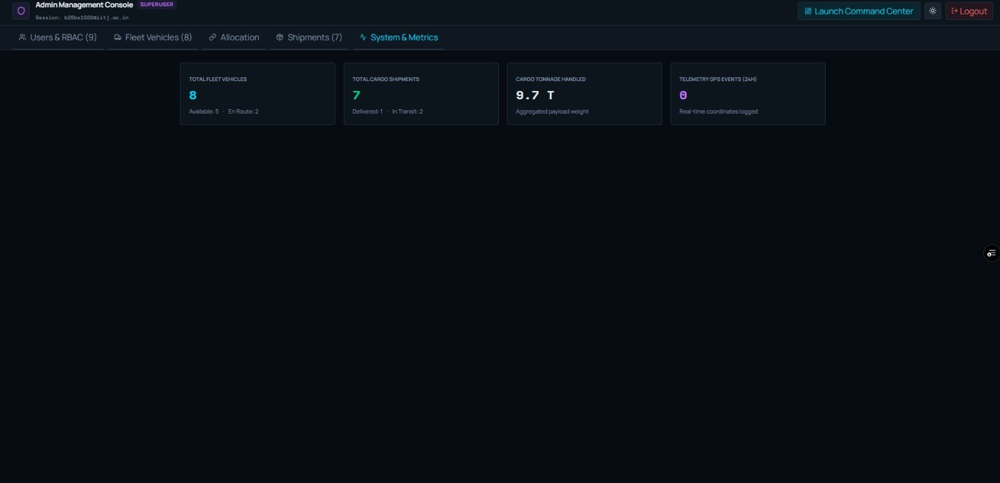
</p>

*System and metrics console summarizing fleet, shipment, tonnage and telemetry indicators.*

---

## 16. Technical Approach — SIH Proposal

The SIH technical approach defines the intended end-to-end architecture around fleet/GPS data, backend processing, AI-based allocation and route optimization, real-time updates, driver execution and customer tracking.

The proposal identifies technologies including React, Node.js/Express, Python, OR-Tools, PostgreSQL/PostGIS, Redis, Kafka, WebSockets, Docker and AWS.

<p align="center">
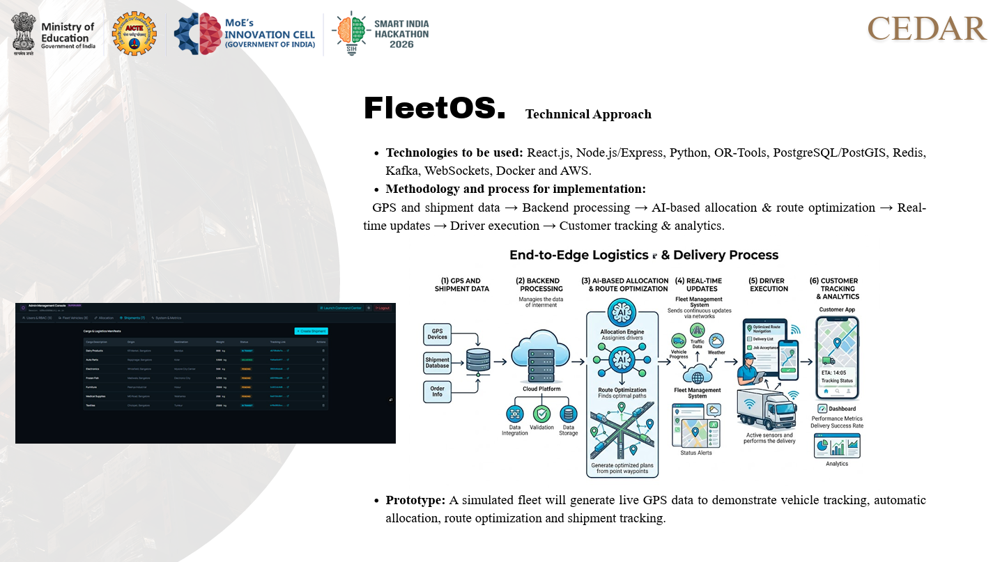
</p>

**Important:** this slide describes the broader proposed architecture. The current repository prototype should not be interpreted as already implementing every listed production technology.

---

## 17. Feasibility & Viability

The prototype is technically demonstrable using open-source technologies, simulated GPS data and synthetic operational data. The SIH proposal identifies practical risks including GPS inaccuracies, connectivity limitations, optimization complexity, limited training data and dependence on external map/cloud services.

The proposed mitigation strategies include real-time caching/streaming, GPS validation, offline synchronization, route caching and fallback algorithms.

<p align="center">
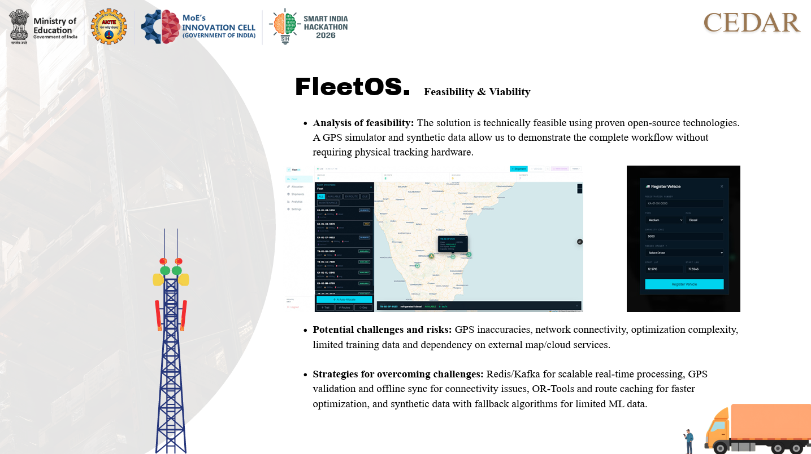
</p>

---

## 18. Current Implemented Architecture

The current repository is intentionally simpler than the proposed production architecture.

```text
┌──────────────────────────────────────────────────────────────┐
│                         FRONTEND                             │
│                 React + TypeScript + Vite                   │
│                                                              │
│ Admin Console · Command Center · Onboarding · Workspaces    │
└──────────────────────────────┬───────────────────────────────┘
                               │
                    REST API + Socket.IO
                               │
┌──────────────────────────────▼───────────────────────────────┐
│                         BACKEND                              │
│                    Node.js + Express                        │
│                                                              │
│ Auth/RBAC · Fleet · Shipments · Allocation · Routes · GPS   │
└───────────────┬─────────────────────┬────────────────────────┘
                │                     │
        ┌───────▼────────┐    ┌───────▼─────────┐
        │ sql.js / SQLite│    │    Socket.IO     │
        │ operational DB │    │ real-time events │
        └────────────────┘    └─────────────────┘
```

### Planned production-scale evolution

The project plan proposes a future architecture with PostgreSQL/PostGIS, Redis, Kafka, dedicated AI/ML optimization, analytics/notification services, Dockerized services and production observability.

Those components are explicitly treated as **roadmap items** unless present in the implementation.

---

## 19. Technology Stack

### Current prototype

| Layer | Technology | Purpose |
|---|---|---|
| Frontend | React + TypeScript + Vite | Application UI |
| Styling | Tailwind CSS | Interface styling |
| Maps | Leaflet / React Leaflet | Fleet visualization |
| Backend | Node.js + Express | REST API and application services |
| Real-time | Socket.IO | Telemetry and state updates |
| Database | sql.js / SQLite | Operational persistence |
| Routing | OSRM | Road routing |
| Distance | Haversine | Geographic fallback |
| Authentication | JWT / Firebase | Identity and authorization |
| Security | Helmet / bcrypt / validation | Application security |

### Proposed production stack

React · Node.js/Express · Python · OR-Tools · PostgreSQL/PostGIS · Redis · Kafka · WebSockets · Docker · AWS

The proposed stack comes from the SIH technical approach and master plan; it should not be read as a list of components currently deployed in the prototype.

---

## 20. API Surface

Application endpoints are exposed under `/api/v1`.

### Authentication

| Method | Endpoint | Description |
|---|---|---|
| `POST` | `/auth/login` | Authenticate user |
| `POST` | `/auth/register` | Register user |
| `POST` | `/auth/verify-otp` | Verify OTP and receive JWT |
| `POST` | `/auth/google` | Google authentication |

### Fleet

| Method | Endpoint | Description |
|---|---|---|
| `GET` | `/fleet/vehicles` | List vehicles |
| `POST` | `/fleet/vehicles` | Register vehicle |
| `PATCH` | `/fleet/vehicles/:id` | Update vehicle |
| `POST` | `/fleet/gps` | Submit GPS update |

### Shipments

| Method | Endpoint | Description |
|---|---|---|
| `GET` | `/shipments` | List shipments |
| `POST` | `/shipments` | Create shipment |
| `PATCH` | `/shipments/:id/status` | Update shipment state |
| `GET` | `/shipments/track/:token` | Public shipment tracking |

### Allocation & Routes

| Method | Endpoint | Description |
|---|---|---|
| `POST` | `/allocation/auto` | Automatic allocation |
| `POST` | `/allocation/batch` | Batch allocation |
| `POST` | `/routes/compute` | Compute route |
| `POST` | `/routes/multi-stop` | Compute multi-stop route |

---

## 21. Project Structure

```text
fleetos/
├── backend/
│   ├── data/
│   ├── scripts/
│   │   ├── gps-simulator.js
│   │   └── reconcile.js
│   └── src/
│       ├── algorithms/
│       ├── cache/
│       ├── config/
│       ├── middleware/
│       ├── realtime/
│       ├── seeds/
│       ├── services/
│       │   ├── allocation/
│       │   ├── auth/
│       │   ├── fleet/
│       │   ├── routes/
│       │   ├── shipments/
│       │   └── users/
│       └── server.js
│
├── frontend-app/
│   ├── public/
│   └── src/
│       ├── components/
│       ├── hooks/
│       ├── lib/
│       ├── pages/
│       ├── App.tsx
│       └── main.tsx
│
├── src/
│   └── assets/
│       └── screenshots/
├── package.json
├── .env.example
├── .gitignore
└── README.md
```

---

## 22. Getting Started

### Prerequisites

- Node.js 18+
- npm 9+

### Clone

```bash
git clone https://github.com/adityarajIITj/FLEETOS.git
cd FLEETOS
```

### Install dependencies

```bash
# Backend
cd backend
npm install

# Frontend
cd ../frontend-app
npm install
```

### Environment configuration

Create the backend environment file from the project template and configure the required authentication, SMTP, Firebase and JWT values.

```bash
cp .env.example backend/.env
```

### Seed and run

```bash
npm run seed
npm run backend:dev
npm run frontend:dev
```

Typical local endpoints:

```text
Backend  → http://localhost:3000
Frontend → http://localhost:5173
```

---

## 23. Security Notes

Never commit real credentials, private keys, SMTP passwords, JWT secrets or Firebase service-account credentials.

The current application includes application-level authentication and authorization controls, but a hackathon prototype should not automatically be treated as production-hardened infrastructure. Production deployment requires additional review of secrets management, transport security, database access, logging, rate limits, dependency security and operational monitoring.

---

## 24. Roadmap

The production-scale roadmap includes:

- PostgreSQL + PostGIS
- Redis caching
- Kafka event streaming
- OR-Tools-based optimization
- Dedicated AI/ML optimization services
- ML-based ETA prediction
- Advanced assignment optimization
- Anomaly detection
- Geofencing and alerts
- Analytics and cost forecasting
- Notification services
- Offline-capable driver PWA
- Dockerized service architecture
- CI/CD
- Production observability

These are future expansion areas, not blanket claims about the current prototype.

---

## 25. Team — CEDAR (Collective for Engineering, Design and Applied Resolution)

| Member | Role | GitHub |

| Divyash Sharma| Team Leader | [@divyanshsharma24-git](https://github.com/divyanshsharma24-git) |

| Aditya Raj | Co-Leader | [@adityarajIITj](https://github.com/adityarajIITj) |

| Atharv | Data Designer | [@fratharv](https://github.com/fratharv) |

| Piyush | Creative | - |

| Drishti | Member | - |

| Chirag | Member | - |


<p align="center">

</p>


---

## 26. Smart India Hackathon Context

**FleetOS** is presented as a software-based logistics solution for Smart India Hackathon 2026, PS2, under the team **CEDAR**.

The proposed end-to-end workflow is:

```text
GPS + Shipment Data
        ↓
Backend Processing
        ↓
Allocation + Route Optimization
        ↓
Real-Time Fleet Updates
        ↓
Driver Execution
        ↓
Customer Tracking + Analytics
```

The repository demonstrates the core operational prototype while the SIH technical approach defines the intended path toward a more scalable production system.

---

<div align="center">

## FleetOS

**Track. Optimize. Deliver.**

Smart logistics with real-time operational visibility.

</div>
